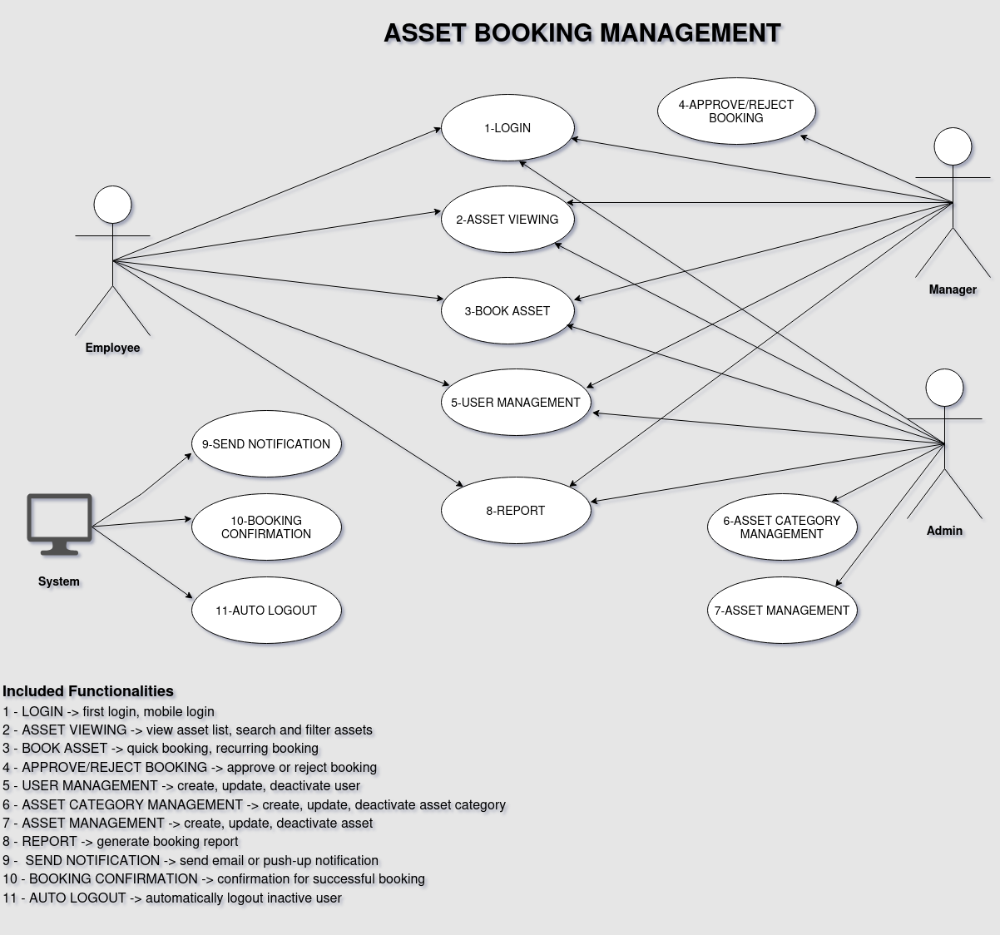

# Asset Booking Management

Welcome to Asset Booking and Management system for your Workplace. 

This is an internal project for Maurer Internship 2026.

## Table of Contents

- [Asset Booking Management](#asset-booking-management)
  - [Table of Contents](#table-of-contents)
  - [Asset Booking Management software system](#asset-booking-management-software-system)
    - [Introduction](#introduction)
    - [Functional Requirements](#functional-requirements)
    - [Non-Functional Requirements](#non-functional-requirements)
    - [Use Cases Document](#use-cases-document)
    - [Use Cases Diagram](#use-cases-diagram)
    - [Test Plan](#test-plan)
    - [Test Cases Document](#test-cases-document)
  - [Local Development Environment setup and instructions](#local-development-environment-setup-and-instructions)
    - [Environment vars](#environment-vars)
  - [Solution Document](#solution-document)
  - [API first! API documentation](#api-first-api-documdentation)
    - [API Testing with Bruno](#api-testing-with-bruno)
  - [BackEnd](#backend)
    - [BackEnd Code Architecture](#backend-code-architecture)
    - [LDAP Authentication](#ldap-authentication)
    - [Dockerfile](#dockerfile)
  - [Database](#database)
    - [ER Model](#er-model)
    - [Dockerfile for DB](#dockerfile-for-db)
    - [DB Schema migrations](#db-schema-migrations)
  - [FrontEnd](#frontend)
    - [FrontEnd Code Architecture](#frontend-code-architecture)
    - [Dockerfile for FrontEnd](#dockerfile-for-frontend)
  - [CI-CD](#ci-cd)
    - [Pipeline, Builds](#pipeline-builds)
    - [Tests](#tests)
    - [Deployment to VM](#deployment-to-vm)
  - [Demo VM](#demo-vm)
  - [Documentation](#documentation)
    - [Link to Functional Requirements](#link-to-functional-requirements)
    - [Link to Non-Functional Requirements](#link-to-non-functional-requirements)
    - [Link to Use Cases Document](#link-to-use-cases-document)
    - [Link to Use Cases Diagram](#link-to-use-cases-diagram)
    - [Link to Test Cases Document](#link-to-test-cases-document)
    - [Link to Solution Document](#link-to-solution-document)
    - [Link to API Documentation](#link-to-api-documentation)
    - [Link to DB ER Model Documentation](#link-to-db-er-model-documentation)
    - [Link to GitLab Issues board](#link-to-gitlab-issues-board)
    - [Link to GitLab Wiki pages](#link-to-gitlab-wiki-pages)
    - [Link to ADRs folder](#link-to-adrs-folder)
    - [Link to Technical Manual](#link-to-technical-manual)
    - [Link to User Manual](#link-to-user-manual)
  - [Getting started with GitLab?](#getting-started-with-gitlab)
    - [Add your files](#add-your-files)
    - [Integrate with your tools](#integrate-with-your-tools)
    - [Collaborate with your team](#collaborate-with-your-team)
    - [Test and Deploy](#test-and-deploy)
 

---

## Asset Booking Management software system

### Introduction

Asset Booking and Management system for your Workplace. It is a dimple but powerful web and mobile software for booking and management of Maurer workplace assets.

This is an internal project for Maurer Internship 2026.


Key features and examples:
- Book workplace assets easily!
- A great option if your workplace has hot desks that need to be booked by your employees
- Reserve a free parking spot in garage for today
- Reserve a meeting room at 13 h
- Book a shared laptop for using for some period
- System which prevents double bookings
- Book available assets such as parking spots via QR code using mobile app
- Keep a comprehensive list of workplace assets and empower employees to book them effortlessly
- Maintain real-time visibility of assets and people who booked them
- Provides Reports about Asset usage

---

### Functional Requirements

[Link to Functional Requirements](docs/functional-requirements/functional-requirements.adoc)

### Non-Functional Requirements

[Non-Functional Requirements](docs/functional-requirements/non-functional-requirements.adoc)

### Use Cases Document

[Use Case Document](docs/use-cases/useCaseDocument.adoc)

### Use Cases Diagram



### Test Plan

[Test Plan](docs/test-cases/test-plan.adoc)

### Test Cases Document

[Test Cases Document](docs/test-cases/e2e-test-cases.adoc)

## Local Development Environment setup and instructions

[Local Development Environment setup and instructions](/frontend/README.md)

### Environment vars

TODO Add or link content...

## Solution Document

[Solution Document](/docs/solution-document/solution-document.adoc)

## API first! API documentation

[API documentation (assetBooking)](/openapi/assetBookingManagementOpenAPISpec.yaml)

### API Testing with Bruno

1. Open Bruno
2. Create new workspace, name it whatever you want
3. While in the new workspace, choose "Open Collection" option
4. In the menu, navigate to the folder with opencollection.yml (currently tests/api-tests/Asset Booking Management/opencollection.yml)
5. Choose Environment on the right hand side to be Testing so that it sets the proper baseUrl
6. Test endpoints after starting the app with "docker compose up --build"

## BackEnd 

[Backend](/backend/)

### BackEnd Code Architecture

[BackEnd Code Architecture](/backend/src/)

### Dockerfile

[Dockerfile](/backend/Dockerfile)

## Database

[Database](/deployment/database/db_init.sql)

### ER Model

[ER Model](/docs/database/ER.png)

### Dockerfile for DB


### DB Schema migrations

[Database](/deployment/database/db_init.sql)

## FrontEnd

[Frontend](/frontend/)

### FrontEnd Code Architecture

[Frontend Code Arhitecture](/frontend/src/)

### Dockerfile for FrontEnd

[Dockerfile](/frontend/Dockerfile)

## CI-CD

TODO Add or link content...

### Pipeline, Builds

[CI-CD](/docs/adr/ADR-005-CI%20-%20CD%20Pipelines.adoc)

### Tests

TODO Add or link content...

### Deployment to VM

TODO Add or link content...

## Demo VM

TODO Add or link content...

## Documentation

### Link to Functional Requirements
[Functional Requirements](docs/functional-requirements/functional-requirements.adoc)

### Link to Non-Functional Requirements

[Non-Functional Requirements](docs/functional-requirements/non-functional-requirements.adoc)

### Link to Use Cases Document
[Use Cases Document](docs/useCase/useCaseDocument.adoc)

### Link to Use Cases Diagram
[Use Case Diagram](docs/use-cases/UseCaseDiagram.png)

### Link to Test Cases

[Test Cases Document](docs/test-cases/e2e-test-cases.adoc)

### Link to Solution Document

[Solution Document](/docs/solution-document/solution-document.adoc)

### Link to API Documentation

[API documentation (assetBooking)](/openapi/assetBookingManagementOpenAPISpec.yaml)

### Link to DB ER Model Documentation

[ER Model Documentation](/docs/database/ER.png)

### Link to GitLab Issues board

https://student-gitlab.tn.internal/studentpractice/asset-booking-management/-/issues

### Link to GitLab Wiki pages

https://student-gitlab.tn.internal/studentpractice/asset-booking-management

### Link to ADRs folder

[ADR folder](docs/adr)

### Link to Technical Manual

[Tehnical Manual](/docs/technical-manual/technical-manual.adoc)

### Link to User Manual

[User Manual](/docs/user-manual/user-manual.adoc)


## Getting started with GitLab?

To make it easy for you to get started with GitLab, here's a list of recommended next steps.

Already a pro? Just edit this README.md and make it your own according company standards.

### Add your files

* [Create](https://docs.gitlab.com/ee/user/project/repository/web_editor.html#create-a-file) or [upload](https://docs.gitlab.com/ee/user/project/repository/web_editor.html#upload-a-file) files
* [Add files using the command line](https://docs.gitlab.com/topics/git/add_files/#add-files-to-a-git-repository) or push an existing Git repository with the following command:

```
cd existing_repo
git remote add origin https://student-gitlab.tools.split.local/studentpractice/asset-management.git
git branch -M main
git push -uf origin main
```

### Integrate with your tools

* [Set up project integrations](https://student-gitlab.tools.split.local/studentpractice/asset-management/-/settings/integrations)

### Collaborate with your team

* [Invite team members and collaborators](https://docs.gitlab.com/ee/user/project/members/)
* [Create a new merge request](https://docs.gitlab.com/ee/user/project/merge_requests/creating_merge_requests.html)
* [Automatically close issues from merge requests](https://docs.gitlab.com/ee/user/project/issues/managing_issues.html#closing-issues-automatically)
* [Enable merge request approvals](https://docs.gitlab.com/ee/user/project/merge_requests/approvals/)
* [Set auto-merge](https://docs.gitlab.com/user/project/merge_requests/auto_merge/)

### Test and Deploy

Use the built-in continuous integration in GitLab.

* [Get started with GitLab CI/CD](https://docs.gitlab.com/ee/ci/quick_start/)
* [Analyze your code for known vulnerabilities with Static Application Security Testing (SAST)](https://docs.gitlab.com/ee/user/application_security/sast/)
* [Deploy to Kubernetes using Auto Deploy](https://docs.gitlab.com/ee/topics/autodevops/requirements.html)
* [Use pull-based deployments for improved Kubernetes management](https://docs.gitlab.com/ee/user/clusters/agent/)
* [Set up protected environments](https://docs.gitlab.com/ee/ci/environments/protected_environments.html)

