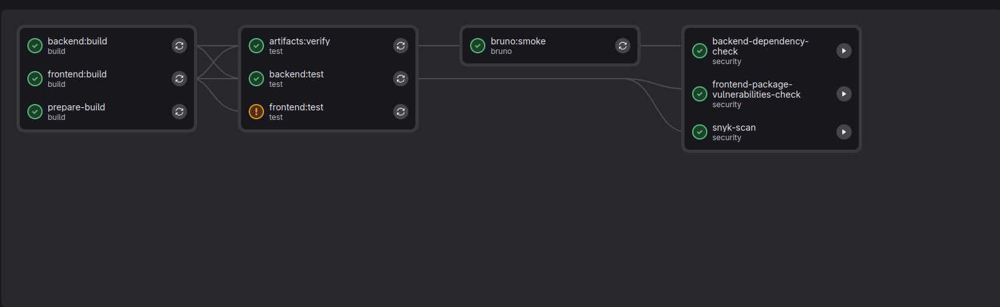
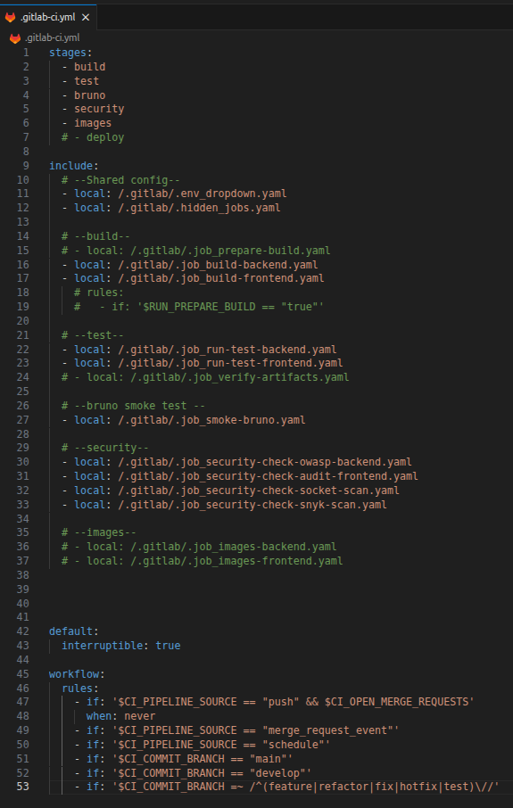
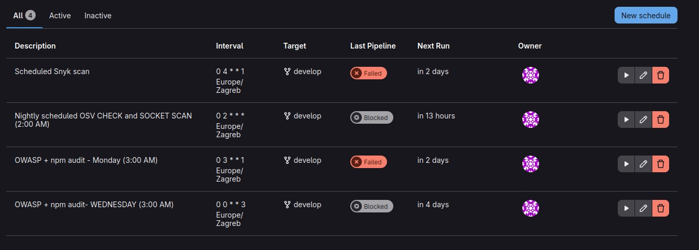
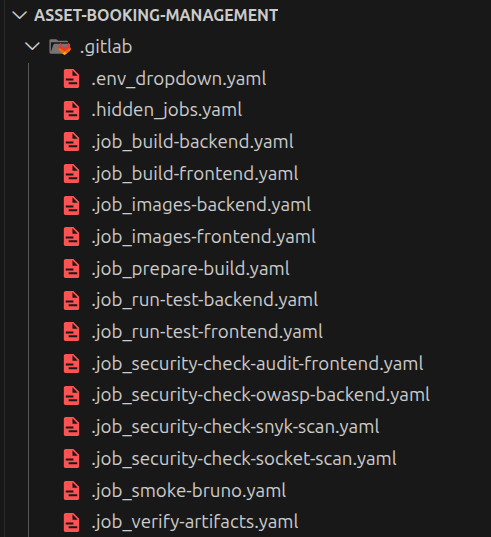
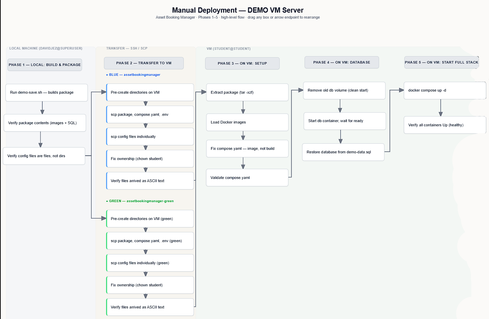

# CI/CD Pipeline

Asset Booking Management uses GitLab CI, with branching following GitFlow (see [ADR-006](adr/ADR-006-GitFlow%20strategy.adoc)). Continuous Integration — build, automated tests, API smoke tests, and security scanning — runs on every merge request and on `main`/`develop`/feature-type branches. Continuous Delivery to a VM is not automated yet: the pipeline's `deploy` stage and its container-image publishing stage are fully drafted but intentionally left disabled, and deployment today is a manual step. The overall CI/CD direction is recorded in [ADR-005](adr/ADR-005-CI%20-%20CD%20Pipelines.adoc).

## Overview

| | |
|---|---|
| **CI platform** | GitLab CI (`.gitlab-ci.yml` + `.gitlab/*.yaml` includes) |
| **Branching model** | GitFlow — `main`, `develop`, `feature/*`, `refactor/*`, `fix/*`, `hotfix/*`, `test/*` |
| **Active stages** | `build` → `test` → `bruno` → `security` |
| **Drafted** | `images` (Harbor push), `deploy` (VM deploy) |
| **Current deploy method** | Manual: SSH into the VM, transfer latest, `docker compose up` |

## Pipeline Architecture

Solid nodes run on every qualifying pipeline. Dashed nodes are real job definitions that exist in the repo but are not wired into the running pipeline (their `include:` lines, or in `deploytovm`'s case the whole job, are commented out in `.gitlab-ci.yml`).

## Trigger Rules

Pipelines run when (`.gitlab-ci.yml` → `workflow:rules`):

- A merge request is open (`merge_request_event`) — a plain `push` to a branch with an open MR is suppressed, so only the MR pipeline runs (avoids duplicate pipelines).
- On a scheduled pipeline (`schedule`).
- On push to `main`.
- On push to `develop`.
- On push to a branch matching `feature/*`, `refactor/*`, `fix/*`, `hotfix/*`, or `test/*`.

Individual jobs share this same condition set via a reusable rules block, `.standard_rules`, defined in `.gitlab/.hidden_jobs.yaml`.

Manually-triggered pipelines also expose a dropdown on GitLab's "Run pipeline" page, defined in `.gitlab/.env_dropdown.yaml`:

- `RUN_OWASP`, `RUN_SOCKET`, `RUN_SNYK` — defined in the file, managed via Gitlab's variables. The security jobs  use these tags in their own `rules:` for scheduled-pipeline runs.

## Pipeline Stages in Detail

### Build

| Job | Purpose | Image | Key rule |
|---|---|---|---|
| `backend:build` | `mvn clean install -DskipTests`, produces `backend/target/*.jar` | `maven:3.9-eclipse-temurin-21` | Standard rules |
| `frontend:build` | `npm ci --legacy-peer-deps && npm run build`, produces `frontend/dist/` | `node:24-alpine` | Standard rules |

Both cache their dependency directories (`backend/.m2/repository/`, `frontend/node_modules/`) keyed on their lockfile (`pom.xml`, `package-lock.json`).

### Test

| Job | Purpose | Image | Key rule |
|---|---|---|---|
| `backend:test` | `mvn verify` against a real `postgres:18` service container (Testcontainers), publishes JUnit report | `maven:3.9-eclipse-temurin-21` | Standard rules; needs `backend:build` artifacts |
| `frontend:test` | Installs Playwright + Chromium, `npm run test` | `node:24-slim` | Standard rules; needs `frontend:build` artifacts; **`allow_failure: true`** |

Frontend tests are currently allowed to fail without blocking the pipeline, this would change when auto deploy is finished.

### Bruno API Smoke Tests

| Job | Purpose | Image | Key rule |
|---|---|---|---|
| `bruno:smoke` | Boots the real Spring Boot backend (`spring-boot:run`) against a `postgres:18` service, waits for it to answer on `/API/v1/auth/login`, then runs the Bruno collection at `tests/api-tests/bruno/Testing` with `bru run`, publishing a JUnit report | `node:24-alpine` (installs Maven, OpenJDK 21, and the Bruno CLI at start) | Standard rules; **`allow_failure: true`** |

This is a genuine black-box smoke test — it exercises the packaged application over HTTP rather than calling code directly, catching wiring issues unit tests would miss.

### Security

| Job | Purpose | Runs automatically on | Manual on |
|---|---|---|---|
| `backend-dependency-check` | OWASP Dependency-Check (`mvn verify -Powasp`) against backend dependencies | `main`; scheduled pipelines when `RUN_OWASP == "true"` | `develop`, feature-type branches (`allow_failure: true`) |
| `frontend-package-vulnerabilities-check` | `npm audit --audit-level=high --omit=dev` | `main`; scheduled pipelines when `RUN_OWASP == "true"` | `develop`, feature-type branches (`allow_failure: true`) |
| `snyk-scan` | `snyk test` + `snyk monitor` against `frontend/package.json`, publishes an HTML report | Scheduled pipelines when `RUN_SNYK == "true"` | `develop` (`allow_failure: false`), feature-type branches (`allow_failure: true`).|
| `socket-security` | Socket.dev supply-chain scan via `socketcli` | `main`/`develop`, only when a commit touches `**/package.json`, `**/package-lock.json`, or `**/pom.xml`; scheduled pipelines when `RUN_SOCKET == "true"` | Never manual — either it matches the automatic condition or it doesn't run (`when: never` otherwise) |

Security jobs are deliberately not full blockers on every branch: running them on `main` automatically and leaving them as an explicit manual/allow-failure option on feature branches keeps day-to-day MR pipelines fast, while still making the scans one click away before merging.

## Not-Yet-Active Jobs

Several jobs are fully written but not currently part of the running pipeline — their `include:` lines are commented out in `.gitlab-ci.yml`:

- **`prepare-build`** (`.gitlab/.job_prepare-build.yaml`) — prints Java/Maven/OS version and runner info for diagnostics. Gated by `RUN_PREPARE_BUILD`, but not included in current pipeline run.
- **`artifacts:verify`** (`.gitlab/.job_verify-artifacts.yaml`) — sanity-checks that the backend jar and frontend `dist/` were actually produced by the build stage. Not included.
- **`images-backend`** / **`images-frontend`** (`.gitlab/.job_images-backend.yaml`, `.gitlab/.job_images-frontend.yaml`) — build a Podman image from each service's `docker/Dockerfile` and push it to the internal Harbor registry (`$IMAGEPUSHREGISTRY`). Each depends on its corresponding `:build` and `:test` jobs. Not included.
- **`deploy2vm`** (drafted directly in `.gitlab-ci.yml`, currently commented out in full) — the actual VM deployment.
This job would run on a self-hosted runner (i.e. a runner with access to the target VM), pull freshly-published images from Harbor, and cycle the stack with `docker compose down → prune → pull → up -d`. It's gated `when: manual` on both `develop` and `main`, so even once enabled, a person still clicks "run" in the GitLab UI — matching the "controlled go/no-go" language in ADR-005. Because it `needs` the also-dormant `images-*` jobs, turning on deployment automation requires enabling image publishing first.

## Deployment

**Today:** deployment to the demo VM is manual. Someone with access must SSH (i.e. ADMIN) into the VM, transfer lates code from local machine to DEMO VM server, and runs `docker compose up --build`. No CI job is involved. This deployment has similar but different `compose.yaml` and `.env` files from development environment.

### Manual Deployment Workflow

The manual process follows a package-based, blue/green pattern, fully documented step-by-step in [`vm-deployment-guide.md`](presentation/vm-deployment-guide.md):

1. **Local — build & package:** `deployment/demo-save.sh` builds the images and bundles them together with a database dump into `deployment/demo-package.tar.gz`.
2. **Transfer to VM:** the package, `compose.yaml`, `.env`, and the individual monitoring config files (Postgres, Prometheus, Loki, Tempo, Alloy, Grafana provisioning) are transfered via `scp` command to the VM. Directories are pre-created on the VM before transfer, and config files are copied individually rather than with `-r`, since Docker will silently mount a missing path as an empty directory instead of a file. Two parallel target directories support blue/green rollout — `~/assetbookingmanager` (blue) and `~/assetbookingmanager-green` (green) — so a new version can be staged without tearing down the currently running one.
3. **VM setup:** the package is extracted, images are loaded with `docker load`, and `compose.yaml` is checked to reference `image:` rather than `build:`, so the VM runs the pre-built images instead of rebuilding locally. `docker compose config --quiet` validates the file before anything is started.
4. **Database:** any previous `db_data` volume is removed for a clean slate, the `db` container is started on its own first, and the demo dataset (`demo-data.sql`) is restored into it before the rest of the stack comes up. Credentials are always read from `.env` (`DB_USER`/`DB_NAME`), not assumed.
5. **Full stack startup:** `docker compose up -d` brings up the application (backend, frontend) alongside the observability stack — Prometheus, Grafana, Loki, Tempo, Alloy, and a Postgres exporter — and `docker compose ps` is used to confirm every container reports `Up`/`Up (healthy)`.

This runbook also captures a set of golden rules (never `sudo` during file transfers, always pre-create directories before `scp`, config files mounted into containers must be files not directories) and a troubleshooting section for the failure modes hit while running this process against the demo VM (bad directory mounts, root-owned files, Postgres role/database mismatches, YAML indentation errors after removing `build:` blocks). See the guide for the full checklist and recovery steps.

**Once enabled:** `deploy2vm` job is the drafted replacement for this manual step — it does the equivalent of `docker compose down/pull/up -d`, but against pre-built images pulled from Harbor rather than building on the VM, and triggered from a pipeline instead of an SSH session.

## Current Limitations & Roadmap

This project is at the stage where CI is hardened and CD is designed but deliberately not yet switched on:

- **Image publishing is off.** `images-backend`/`images-frontend` exist and would push to Harbor, but aren't included in the pipeline.
- **Deployment is manual.** `deploy2vm` exists and is the drafted from ADR-005's automated-deployment goal, but it's gated `when: manual`, depends on image publishing being enabled first, and is currently commented out entirely.
- **Frontend tests and the Bruno smoke suite don't block the pipeline** (`allow_failure: true`), so they currently function as visibility rather than a hard gate.

None of this blocks the project today — CI already gives fast, reliable feedback on every change. Enabling `images-*` and then `deploy2vm` is the next concrete increment toward the CD part of full CI/CD pipeline.

## References

- [`.gitlab-ci.yml`](../.gitlab-ci.yml) — root pipeline definition, stages, includes, workflow rules
- [`.gitlab/`](../.gitlab/) — individual job definitions
- [ADR-005: CI/CD Pipelines](adr/ADR-005-CI%20-%20CD%20Pipelines.adoc)
- [ADR-006: GitFlow Branching Strategy](adr/ADR-006-GitFlow%20strategy.adoc)
