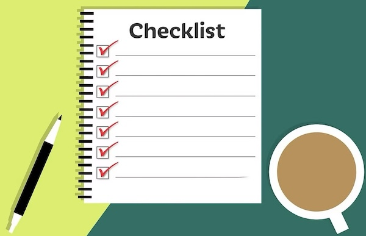

= Project Release Resources Checklist
:toc: left
:toclevels: 2
:sectnums:
:icons: font
:source-highlighter: coderay

== Project Release Resources Checklist

[NOTE]
Here is the AI generated and human verified and optimised **checklist** of essential resources and artifacts to inspect during a software project Release Note or Project Review session.

=== Live Product Demo 

* An introduction into Project task or short Project overview.
* A functional staging or pre-production environment ready for a **live walkthrough**. 
* A live walkthrough of mobile application use cases.

=== Technical Deliverables

* **Production Codebase**: Verified repository branch containing the final, compiled source code.
* **Release Notes**: High-level, user-friendly summaries of new features, improvements, and bug fixes in a single asciidoc or markdown document.
* **API Documentation**: Updated OpenAPI specification, Swagger, Bruno, or Markdown files for system integrations.
* **Architecture Diagrams**: Solution document of final blueprints showing system components and data flows. [1, 2, 3, 4, 5] 
* **Definition of Done (DoD)**: The team’s agreed checklist proving the software meets all quality standards. [14, 15, 16] 

=== Quality Assurance (QA) Evidence and Deliverables

* **Test Summary Report**: Overview of executed test cases, pass/fail rates, and test coverage for following types of tests: API tests, Smoke Tests and E2E tests.
* **Defect Log**: List of resolved, deferred, and open bugs with severity ratings.
* **Performance Metrics**: Results from load testing, stress testing (if performed), and system speed benchmarks (if performed).
* **Security Scan Reports**: Output from dependency check tools and vulnerability scanners. [6, 7, 8, 9, 10] 
* **Product Issues and Backlog Status** (on GitLab): Visual representation of the completed epics, user stories, tasks, bugs. Showing also open issues, Issues board(s) and Product Backlog.

=== Deployment & Operations

* **Deployment Runbook**: Step-by-step instructions for installing and configuring the software.
* **Continious Deployment Plan**: The steps, schedule and safety nets for pushing the software to the various environment (e.g. DEMO or PRODUCTION system).
* **Rollback Plan**: Clear procedure to revert the deployment on environment if a critical failure occurs.
* **Infrastructure Code**: GitLab CI/CD pipeline/stage for deployment to DEMO VM, Dockerfile's and Docker Compose files, bash scripts, configurtion scripts, sample.env file,..
* **Monitoring Dashboards**: Centralised logs, health-check endpoints (for db, backend, frontend), alerts/alarms (if needed and configured), Server stats (memory, disk space, network), JVM stats, API Request stats   
* **Support & Operations Guide**: Documentation for handling post-release issues or user questions. [17] 

=== Project Management & Governance

* **Handover All Documentation**: User manual, Technical manual, README with local installation guide, How to use tools (Sonar, various security checks, Loki, Grafana) - all must be committed in project git repo. Recorded video walkthroughs through GUI (if exists, because of huge size it must not be committed into git repo).
* **Project WIKI  Documentation** (on GitLab): Showing documentation and notes on Project GitLab WIKI pages.
* **Requirements Traceability Matrix**: Grid proving every initial scope item was built and tested.
* **Lessons Learned documents**: Notes on team successes, bottlenecks, and future improvements and recommendations. [11, 12, 13] 

---

=== References

- [1] https://www.ionos.co.uk/digitalguide/websites/web-development/code-review/[https://www.ionos.co.uk]
- [2] https://document360.com/blog/software-documentation/[https://document360.com]
- [3] https://medium.com/writers-journal/7-ideal-documents-for-your-technical-writing-portfolio-168ed9942030[https://medium.com]
- [4] https://www.coursehero.com/file/219630628/Lesson-3-COMPUTER-ARCHITECTURE-AND-ORGANIZATIONpdf/[https://www.coursehero.com]
- [5] (https://blog.devsecopsguides.com/p/devsecops-process-management)[https://blog.devsecopsguides.com]
- [6] https://www.frugaltesting.com/blog/mastering-software-testing-a-best-practices-checklist[https://www.frugaltesting.com]
- [7] https://www.testrail.com/blog/software-testing-life-cycle-stlc/[https://www.testrail.com]
- [8] https://testsigma.com/blog/test-deliverables/[https://testsigma.com]
- [9] https://www.qatouch.com/blog/software-test-plan-template/[https://www.qatouch.com]
- [10] https://tractian.com/en/glossary/pre-startup-safety-review-pssr[https://tractian.com]
- [11] https://aqua-cloud.io/uat-examples/[https://aqua-cloud.io]
- [12] https://productive.io/blog/project-closure/[https://productive.io]
- [13] https://miro.com/kanban/what-is-a-kanban-board/[https://miro.com]
- [14] https://www.upgrad.com/blog/scrum-artifacts/[https://www.upgrad.com]
- [15] https://www.adaface.com/blog/agile-interview-questions/[https://www.adaface.com]
- [16] https://www.browserstack.com/guide/software-requirement-specifications-in-agile[https://www.browserstack.com]
- [17] https://www.cortex.io/post/how-to-create-a-great-production-readiness-checklist[https://www.cortex.io]

