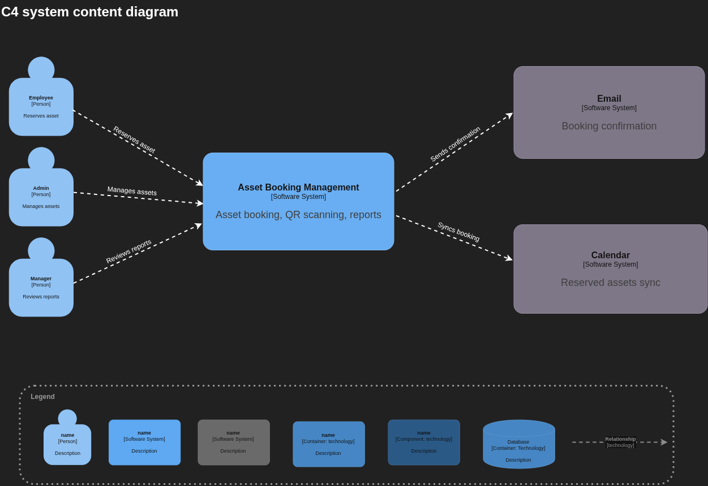
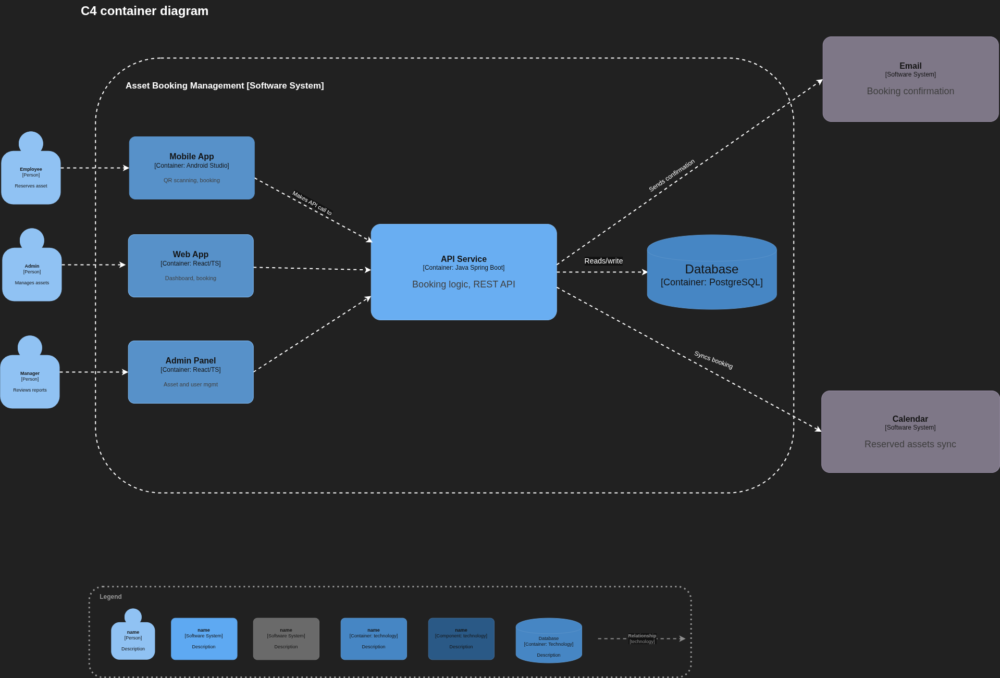
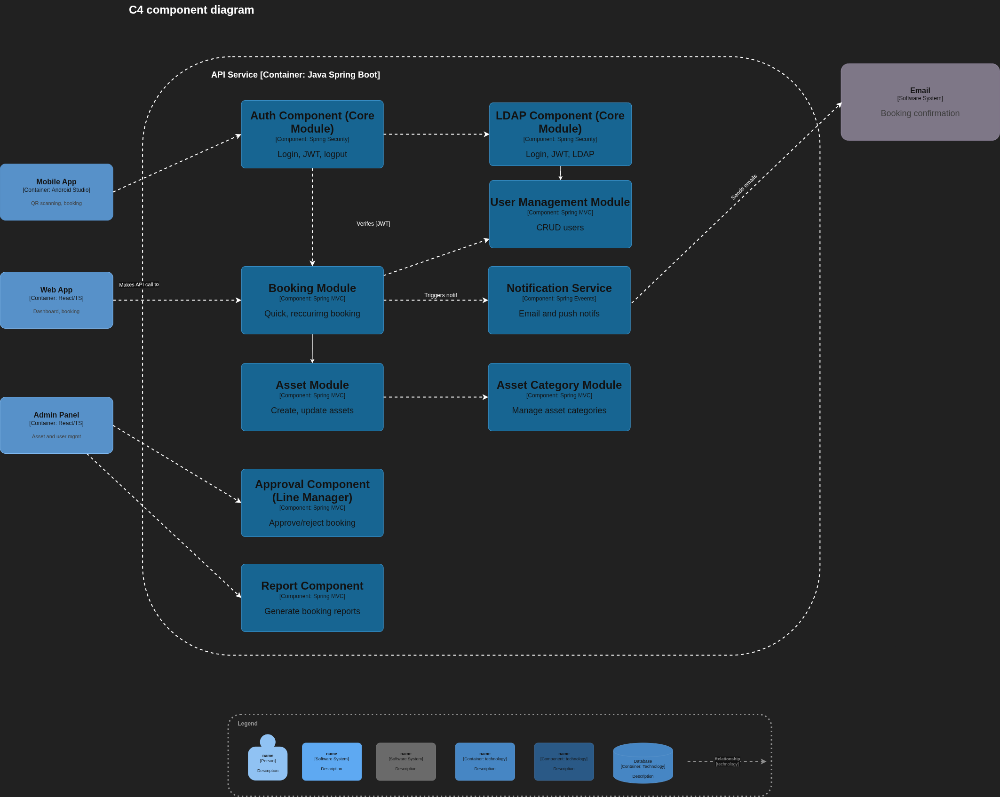
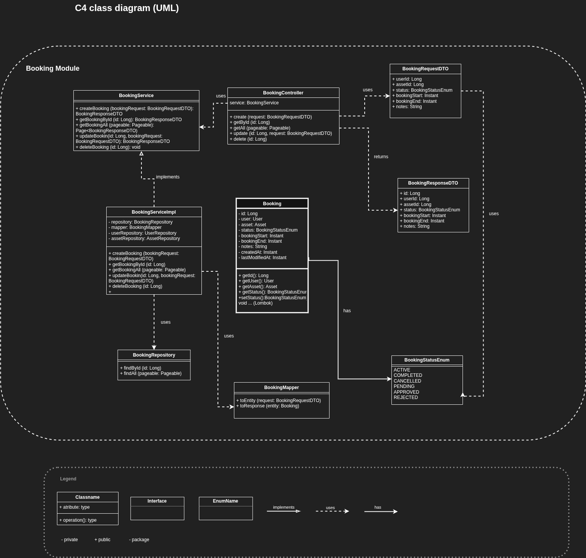

= Solution Architecture Document (SAD)
Project Team
v1.1-draft, April 20, 2026
:toc:
:toclevels: 4
:icons: font
:sectnums:
:numbered:

== Document Control

Version: v1.0-draft

Authors: Project Team

Date: April 20, 2026

Approval: TBD

Change History: v1.0-draft — Initial SAD draft based on provided architecture decisions, domain model, use cases, and solution artifacts.

== Executive Summary

This document describes the target solution architecture for the Asset Booking Management System, an internal application used to manage shared company assets such as meeting rooms, laptops, parking spaces, desks, books, and similar resources.

The solution is intended to provide a secure, maintainable, and scalable foundation for browsing assets, managing categories and assets, creating and approving bookings, preventing booking conflicts, sending confirmations, synchronizing calendar events, and producing usage reports.

The architecture is based on a modular monolith (modulith) implemented with Spring Boot on the backend and a modern React frontend. The design prioritizes simplicity, maintainability, clear domain boundaries, and low operational overhead for an internal user base of approximately 200–300 users.

This SAD consolidates the current architectural direction and identifies planned integrations, infrastructure needs, security controls, non-functional expectations, delivery approach, and major risks.

== Solution Architecture Overview

The Asset Booking Management System is a role-based internal platform supporting three main user roles:

* Employee — browses assets, checks availability, creates bookings, modifies or cancels own bookings, uses quick booking flows, and receives confirmations.
* Admin — manages users, assets, asset categories, booking rules, and operational data.
* Manager — reviews reports and handles booking approvals for categories that require approval.

At a high level, the solution consists of:

* A backend API implemented as a single Spring Boot application.
* A React-based frontend for browser access.
* Support for mobile or QR-assisted booking flows where required.
* A PostgreSQL database as the system of record.
* Supporting integrations for directory-based first login, email notifications, calendar synchronization, and optional push/biometric capabilities.
* An optional caching and rate-limiting layer using Valkey, pending final implementation approval.

The architectural style is a modulith: one deployable application with domain-oriented internal modules and explicitly managed boundaries. This enables simpler deployment and operations than microservices while still preserving separation of concerns at the code and business-domain level.

.C4 Container Diagram

== Business Case

Organizations with shared physical resources need a reliable way to allocate them fairly, visibly, and efficiently. Without a dedicated solution, booking processes often become fragmented across spreadsheets, email, chat, or informal agreements, which increases the risk of double booking, poor resource utilization, and weak auditability.

The proposed solution addresses this by centralizing:

* Asset discovery and availability checks.
* Booking creation and lifecycle management.
* Category-specific booking rules.
* Approval workflows for restricted assets.
* Notification and calendar synchronization.
* Reporting for utilization analysis.

Expected business benefits include:

* Reduced administrative effort.
* Improved employee experience when reserving assets.
* Better visibility into asset usage and demand.
* Lower incidence of booking conflicts.
* Stronger governance and accountability through role-based access and audit-friendly workflows.

== Requirements Summary

=== Business Requirements

The solution shall support the following business capabilities:

* User authentication for Employees, Managers, and Admins.
* First login using corporate directory credentials.
* Optional biometric login flows where supported.
* Automatic logout of inactive users.
* User management with role assignment and permissions.
* Asset category management including booking rules.
* Asset management including creation, update, deactivation, and QR code generation.
* Asset browsing, search, filtering, and availability checking.
* Booking flows for multiple asset types such as laptops, parking spots, desks, meeting rooms, and books.
* Booking modification and cancellation.
* Quick booking via QR code.
* Recurring booking where allowed by category rules.
* Priority booking based on configured role or benefit rules.
* Booking confirmation after successful reservation.
* Prevention of double booking.
* Manager approval workflows for selected categories.
* Usage reporting for specific assets and asset types.
* Calendar synchronization and email notifications.

=== Technical Requirements

The solution shall:

* Be implemented as a Spring Boot backend with clearly separated domain modules.
* Provide REST/JSON APIs for frontend and mobile/QR-enabled clients.
* Use PostgreSQL as the primary relational database.
* Use TypeScript for frontend development.
* Use React 19 as the frontend library.
* Use Vite as the frontend build tool.
* Follow a feature-based frontend structure.
* Support automated CI/CD pipelines across QA, staging, and production environments.
* Use structured branching with Gitflow.
* Support future introduction of caching and rate limiting through Valkey.

=== Constraints and Assumptions

* The system is an internal company application with an expected user base of approximately 200–300 users.
* The project is a greenfield implementation.
* The primary architectural optimization goals are maintainability, simplicity, and low operational overhead rather than independent service scaling.
* Certain implementation details remain to be finalized, including exact identity provider configuration, production hosting topology, monitoring stack, and final scope of biometric support.

== High-Level Solution Design

=== Logical View

The solution is organized around the following logical layers:

* Presentation layer — browser-based UI and optional mobile/QR-assisted user interaction.
* Application/API layer — Spring Boot REST API exposing business capabilities.
* Domain layer — business modules for user, asset category, asset, booking, reporting, and shared utilities.
* Persistence layer — PostgreSQL database and repositories.
* Integration layer — external adapters for directory login, email notifications, calendar synchronization, and optional caching.

.C4 L2 — Container Diagram

=== Core Business Flow

A typical booking flow is:

. A user authenticates into the application.
. The user browses assets or scans a QR code.
. The system checks category rules, user permissions, and asset availability.
. The system validates that the requested time slot does not conflict with existing bookings.
. If approval is required, the request is stored as pending and routed to the responsible manager.
. If approval is not required, or after approval is granted, the booking is confirmed.
. The system records the booking, updates availability, sends confirmation notifications, and optionally synchronizes the reservation to a calendar system.

=== Major Components

* Frontend client(s) for asset discovery, booking, administration, and reporting.
* Backend modulith exposing REST endpoints and enforcing business rules.
* PostgreSQL for transactional storage.
* Email integration for confirmations and approval notifications.
* Calendar integration for reservation synchronization.
* Directory integration for first-login bootstrap.
* Optional Valkey integration for rate limiting and caching.

== Detailed Solution Architecture

=== Architectural Style

The backend will be implemented as a modular monolith (modulith). It will be deployed as a single Spring Boot application but internally partitioned into domain-based modules to preserve clear ownership and maintainability.

This style is selected because it offers:

* Lower deployment and operational complexity than microservices.
* Stronger structure than an unorganized monolith.
* Good alignment with the expected scale and team size.
* A migration path for extracting domains later if the system grows substantially.

=== Backend Domain Modules

The initial domain decomposition is:

* `user` — user identities, roles, status, profile data, and user-management behavior.
* `asset-category` — category definitions and booking-rule configuration.
* `asset` — individual assets, metadata, location, availability state, and QR association.
* `booking` — reservation lifecycle, approval state, recurrence, cancellation, modification, and conflict detection.
* `report` — usage statistics, historical reporting, and reporting-oriented query models.
* `core` — shared concerns such as configuration, common helpers, error handling, and cross-cutting infrastructure.

Each domain should encapsulate its own:

* Controllers
* Services
* Entities
* Repositories
* DTOs / mappers
* Validation and domain-specific exception handling

.C4 L3 — Component Diagram

=== Module Interaction Rules

To preserve the modulith architecture, the following rules apply:

* Package-by-domain shall be used.
* Direct cross-domain data access should be avoided.
* Domains should interact through well-defined service interfaces or application-level orchestration.
* Shared logic must be kept in common core/configuration modules instead of being duplicated or leaked across domains.
* Architectural boundaries should be enforced through code review and, where practical, automated architectural tests.

=== Frontend Architecture

The frontend is a React 19 application written in TypeScript and built with Vite.

The frontend shall follow a feature-based folder structure with clearly defined shared layers:

* `app/` for application bootstrap, providers, and routing.
* `assets/` for static resources.
* `components/` for shared UI components.
* `features/` for business-domain functionality.
* `pages/` for route composition.
* `services/` for backend API communication and external integrations.
* `store/` for global client state where necessary.
* `hooks/`, `utils/`, `types/`, `styles/`, and `config/` for shared frontend concerns.

This structure improves maintainability, feature isolation, team collaboration, and long-term scalability.

=== UX Channels

The solution shall support multiple user interaction channels as required by the provided use cases and diagrams:

* Standard browser-based user interface.
* Administrative interface for configuration and management tasks.
* QR-assisted quick booking flow.
* Optional mobile-friendly or mobile-assisted access path for scanning and fast reservation scenarios.

== Integration Architecture

=== Integration Principles

The solution integrates with external systems through explicit adapter layers behind the backend API. External dependencies should not leak into core domain logic.

=== Planned Integrations

* Directory / LDAP integration — supports first-login onboarding using an existing corporate identity source.
* Email integration — sends booking confirmations, manager approval notifications, and operational alerts.
* Calendar integration — synchronizes confirmed bookings to an external calendar platform such as Google Calendar.
* Optional push notification integration — supports mobile or approval notification use cases.
* Optional biometric integration — supports biometric login if approved and technically feasible.
* Optional Valkey integration — provides request caching and rate limiting.

=== API Style and Data Flow

Internal clients communicate with the backend over REST/JSON APIs.

Representative flows include:

* Login and session establishment.
* Asset/category CRUD operations.
* Asset search and availability queries.
* Booking create/read/update/cancel actions.
* Approval actions and notification triggers.
* Reporting queries.
* QR-based asset lookup and quick booking.

=== Integration Reliability Considerations

* External integration failures shall not create inconsistent booking data.
* Booking creation must remain transactional inside the system of record.
* Confirmation and calendar synchronization failures should be retried or surfaced for operational handling.
* Integration actions should be auditable, especially for approvals, overrides, and externally visible confirmations.

== Data Architecture

=== Data Strategy

PostgreSQL is the primary system of record for transactional data and reporting inputs. The design favors strong consistency and safe concurrent booking behavior.

=== Core Logical Entities

The current logical model includes at minimum:

* User
* Department
* AssetCategory
* Asset
* Booking

.C4 L4 — Class Diagram (Booking Module)

=== Entity Summary
==== User
[cols="1,3", options="header"]
|===
| Field | Description

| username | Unique identifier for login
| name | First name of the user
| surname | Last name of the user
| email | Contact and login email
| password | Hashed password
| role | User role (e.g. admin, employee)
| status | Account status (e.g. active, inactive)
| department_id | Reference to Department entity
| manager_id | Reference to another User (manager)
| benefit | Optional benefit assigned to user
| notes | Additional notes
| created_at / updated_at | Audit timestamps
|===

==== Department
[cols="1,3", options="header"]
|===
| Field | Description

| id | Department identity
| name | Department name
| manager_id | Reference to User (manager)
| created_at / updated_at | Audit timestamps
|===

==== AssetCategory
[cols="1,3", options="header"]
|===
| Field | Description

| id | Category identity
| name | Category name
| booking_period | Allowed booking duration
| booking_window | How far in advance booking is allowed
| approval_required | Whether manager approval is needed
| recurrence_allowed | Whether recurring bookings are allowed
| auto_release_policy | Policy for automatic asset release
|===

==== Asset
[cols="1,3", options="header"]
|===
| Field | Description

| id | Asset identity
| category_id | Reference to AssetCategory entity
| name / description | Descriptive data about the asset
| code / qr_code | Code or QR association for identification
| status | Asset status (e.g. available, in-use)
| location | Physical location of the asset
| created_at / updated_at | Audit timestamps
|===

==== Booking
[cols="1,3", options="header"]
|===
| Field | Description

| id | Booking identity
| user_id | Reference to User entity
| asset_id | Reference to Asset entity
| status | Booking status (e.g. pending, approved, cancelled)
| start_at | Booking start timestamp
| end_at | Booking end timestamp
| notes | Additional notes
| created_at / updated_at | Audit timestamps
|===

=== Data Modeling Notes

The use cases require richer rule modeling than the current simplified asset-category draft entity. Therefore, the physical schema should account for category-specific booking configuration either by extending `asset_category` or by introducing a dedicated configuration structure.

Likewise, approval workflows, recurring bookings, notification state, audit history, and override scenarios may require additional tables or columns not yet reflected in the simplified domain-model draft.

=== Data Integrity and Concurrency

To protect booking correctness, the data design shall enforce:

* Referential integrity between users, departments, categories, assets, and bookings.
* Validation of mandatory fields and uniqueness where required.
* Transactional booking creation and approval updates.
* Reliable conflict detection to prevent double booking.
* Auditability for changes affecting availability, approvals, overrides, and deactivations.

=== Reporting Strategy

Reporting will initially be generated from the primary transactional database. If reporting load grows, derived read models, materialized views, or dedicated reporting structures can be introduced later without changing the core domain model.

=== Migration Strategy

Because the project is greenfield, no legacy data migration is required for initial launch. If organizational asset data or user metadata must later be imported from external systems, import routines should be handled as controlled onboarding processes rather than as part of the baseline production release.

== Security Architecture

=== Security Objectives

The security architecture must ensure that only authorized users can access the system, perform actions aligned to their roles, and interact with booking and administrative data in a controlled and auditable manner.

=== Authentication

The use cases require:

* Username/password login.
* First-login support using an LDAP or corporate directory source.
* Optional biometric login.
* Automatic logout of inactive users.

The final implementation should use centralized authentication controls, secure password handling, transport encryption, and session or token expiration policies. Where JWT-based session handling is used, expiration and inactivity handling must align with logout requirements.

=== Authorization

Role-based access control (RBAC) shall be enforced across all APIs and UI capabilities.

Minimum roles are:

* Employee
* Admin
* Manager

Access must be restricted so that users can only perform actions aligned with their business responsibilities. Administrative operations, reporting access, manager approvals, and override capabilities must be explicitly protected.

=== Data Protection

The solution shall incorporate:

* Encrypted transport for all network communication.
* Secure password storage.
* Input validation at API boundaries.
* Controlled handling of personally identifiable information such as names, emails, department data, and manager references.
* Least-privilege database access.
* Database roles and, if needed, Row-Level Security for sensitive data protection.

=== Audit and Traceability

The system should log security-relevant and business-relevant events, including:

* Login and logout events.
* Failed authentication attempts.
* User and role administration changes.
* Asset/category creation and deactivation.
* Booking creation, modification, cancellation, approval, and rejection.
* Manager overrides and affected-user notifications.
* Integration failures relevant to booking confirmation or synchronization.

=== Security Gaps to Finalize

The following security details remain to be finalized during implementation design:

* Exact identity-provider topology.
* Password policy and MFA policy.
* Biometric data storage approach, if biometric login remains in scope.
* Log retention and audit-review processes.
* Secret management and certificate management approach.

== Infrastructure Requirements

=== Runtime Components

The solution requires the following major runtime components:

* Frontend application runtime.
* Spring Boot backend runtime.
* PostgreSQL database.
* Optional Valkey instance for caching/rate limiting.
* CI/CD pipeline infrastructure.
* External connectivity to email, calendar, and directory services.

=== Deployment Model

The solution is suitable for containerized deployment. The application should be packaged and deployed in a repeatable manner across QA, staging, and production environments.

Environment parity should be maintained as closely as practical to reduce deployment drift and testing inconsistencies.

=== Environment Layout

A minimum three-environment delivery path is recommended, but we will simplify it to two environment:

* QA/Demo — automated verification and integration testing, pre-production validation.
* Production — controlled live environment.

=== Build and Release Tooling

The project should use:

* Gitflow for branching.
* Automated CI pipelines on commits and merge requests.
* Automated promotion from CI success into QA and staging.
* A controlled go/no-go step before production promotion.

=== Operational Concerns

The infrastructure design should include:

* Centralized logging.
* Health checks and service observability.
* Backup and restore procedures for PostgreSQL.
* Configuration externalization per environment.
* Secrets management.
* Capacity planning for expected internal traffic and growth.

== Non-Functional Requirements

=== Performance

The system shall provide responsive user interactions for the expected internal user base of approximately 100–150 users and low-to-moderate traffic. Booking validation, availability checks, and booking confirmation paths must be efficient enough to preserve a smooth user experience.

=== Scalability

The chosen modulith architecture scales as a single deployable unit. This is acceptable for the current scope, but the internal domain boundaries should be preserved so that selected modules can be extracted later if scale or organizational complexity requires it.

=== Reliability

The system shall protect booking integrity by preventing double booking, managing approval states correctly, and avoiding partial failures that leave reservations in inconsistent states.

=== Availability

As an internal business application, the system should be available during business operating hours and resilient enough to support normal day-to-day use. Final uptime targets should be agreed with stakeholders and reflected in operational support plans.

=== Maintainability

Maintainability is a primary architectural driver. The use of modulith boundaries, feature-based frontend structure, TypeScript, standardized branching, and automated pipelines shall support easier change management and long-term ownership.

=== Security and Compliance

The solution shall enforce strong access control, secure transport, and controlled handling of user and booking data. Formal compliance requirements and data retention obligations should be confirmed with the organization before production rollout.

=== Observability

The system should expose health information, actionable logs, and sufficient operational telemetry to diagnose failures in authentication, booking workflows, approvals, external integrations, and deployment environments.

== Transition and Implementation Strategy

=== Delivery Approach

This is a greenfield implementation, so transition complexity is lower than in a replacement project. The recommended delivery model is incremental and domain-driven, with a working vertical slice delivered early and extended in phases.

=== Proposed Implementation Phases

. Foundation
* Establish repositories, branching conventions, coding standards, and CI pipeline skeleton.
* Set up frontend and backend project scaffolding.
* Create baseline PostgreSQL schema and local/containerized development setup.

. Core Identity and User Management
* Implement login, first-login directory flow, inactivity timeout, and role model.
* Deliver user management screens and APIs.

. Asset and Category Management
* Implement category configuration, asset CRUD, deactivation rules, and QR code support.

. Booking Core
* Implement asset browsing, availability checks, booking creation, modification, cancellation, and conflict prevention.

. Approval and Notification Features
* Add pending approvals, manager decision flows, email confirmations, and calendar synchronization.

. Reporting and Operational Hardening
* Add reporting, audit improvements, observability, and optional caching/rate limiting.

. Release Readiness
* Conduct end-to-end testing, performance validation, security review, user acceptance testing, and production readiness checks.

=== Indicative Timeline

A phase-based implementation plan is recommended instead of a fixed-date commitment at this stage. Final milestone dates should be set during project planning once team capacity, environment readiness, and integration dependencies are confirmed.

== Risks and Mitigations

[options="header", cols="3,4,4"]
|===
| Risk | Impact | Mitigation

| Modulith boundaries erode over time
| Tight coupling reduces maintainability and future extraction options.
| Enforce package-by-domain, service interfaces, code reviews, and architectural tests.

| Booking conflict logic is incomplete
| Double booking or invalid approvals can undermine trust in the system.
| Design conflict checks transactionally, test edge cases thoroughly, and validate time-based business rules.

| Category rules are under-modeled in the schema
| Functional gaps appear when implementing recurrence, approval rules, booking windows, or release policies.
| Finalize logical-to-physical mapping for category configuration before booking module completion.

| External integrations fail or behave inconsistently
| Notifications or calendar sync may be lost while core booking succeeds.
| Decouple integration adapters, use retries where appropriate, surface failures operationally, and keep booking persistence authoritative.

| Proposed ADR items change during implementation
| Tailwind, CI/CD, and Valkey decisions may shift and affect delivery plans.
| Treat proposed ADRs as planned direction, confirm them before production commitments, and isolate optional infrastructure dependencies.

| React or third-party dependency compatibility issues
| Development friction or upgrade effort may increase.
| Validate library compatibility early, especially for React 19 and any mobile/biometric integrations.

| Security details remain underspecified
| Rework may be needed for identity, secrets, audit, or biometric handling.
| Finalize security design early and include stakeholder review before broad implementation.
|===

== Appendices

=== Source Inputs Used for This SAD

This draft is based on the provided project artifacts, including:

* SAD lean template.
* ADRs for modulith architecture, TypeScript, PostgreSQL, CI/CD, Gitflow, Vite, React 19, frontend folder structure, Tailwind CSS, and Valkey.
* Domain model draft.
* Asset category domain draft.
* Use case specification.
* Provided solution and C4 diagrams.

=== Items Requiring Final Confirmation

* Exact production hosting topology.
* Concrete Docker/orchestration setup.
* Final authentication and token/session mechanism.
* Email provider and calendar integration implementation details.
* Monitoring and alerting stack.
* Final decision on biometric feature scope.
* Final decision on Valkey adoption timeline.

=== Suggested Next Documents

The following supporting documents are recommended after SAD approval:

* API specification.
* Deployment architecture / infrastructure design.
* Security design and threat model.
* Database schema specification.
* Test strategy.
* Operational runbook.

== Glossary

[options="header", cols="1,3"]
|===
| Term | Definition

| SAD
| Solution Architecture Document.

| ADR
| Architecture Decision Record.

| Modulith
| A modular monolith: a single deployable application internally divided into well-defined modules.

| RBAC
| Role-Based Access Control.

| LDAP
| Lightweight Directory Access Protocol, used for directory-based identity integration.

| CI/CD
| Continuous Integration / Continuous Delivery.

| REST API
| An HTTP-based interface exposing system functionality through resources and operations.

| DTO
| Data Transfer Object.

| QR Code
| A machine-readable code used here for fast asset lookup or booking initiation.

| Valkey
| An in-memory datastore proposed for caching and rate limiting.
|===
