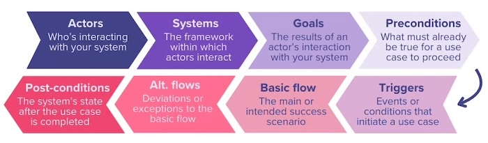

= Asset Management System — Use Case Specification

== Use Case Index

[cols="1,4,2", options="header"]
|===
| UC # | Name | Actors

| <<UC-01>> | Login via web or mobile app | Employee, Manager, Admin
| <<UC-02>> | First login | System
| <<UC-03>> | Biometric login | Employee, Manager, Admin
| <<UC-04>> | Adding biometric parameters | Employee, Manager, Admin
| <<UC-05>> | Auto logout of inactive users | System
| <<UC-06>> | User management | Admin
| <<UC-07>> | Administrator adds a new asset to the system | Admin
| <<UC-08>> | Administrator edits asset data | Admin
| <<UC-09>> | Administrator deletes (deactivates) an asset from the system | Admin
| <<UC-10>> | Administrator adds a new asset category | Admin
| <<UC-11>> | Administrator edits or deletes an asset category | Admin
| <<UC-12>> | User views the asset list | Employee, Manager, Admin
| <<UC-13>> | Book laptop | Employee
| <<UC-14>> | Book parking spot | Employee
| <<UC-15>> | Book desk | Employee
| <<UC-16>> | Book meeting room | Employee
| <<UC-17>> | Borrow a book | Employee
| <<UC-18>> | Cancel booking | Employee
| <<UC-19>> | View bookings | Employee
| <<UC-20>> | Modify booking | Employee
| <<UC-21>> | Quick booking assets | Employee
| <<UC-22>> | Recurring booking | Employee
| <<UC-23>> | Priority booking | Employee, Manager
| <<UC-24>> | Booking confirmation | System
| <<UC-25>> | Prevent double booking | System
| <<UC-26>> | Specific asset usage | Admin, Authorized Users
| <<UC-27>> | Specific asset type usage | Admin, Authorized Users
| <<UC-28>> | Manager receives booking approval notification | System
| <<UC-29>> | Manager reviews asset booking request | Manager
| <<UC-30>> | Manager approves asset booking | Manager
| <<UC-31>> | Manager rejects asset booking | Manager
| <<UC-32>> | Booking is added to Google Calendar | System
| <<UC-33>> | Manager receives booking request email notification | System
| <<UC-34>> | User checks asset availability via QR code | User
| <<UC-35>> | Asset return and verification | Employee
| <<UC-36>> | View asset location | Employee
| <<UC-37>> | Search and filter assets | Employee
| <<UC-38>> | View pending booking requests | Manager, Admin
| <<UC-39>> | Automatically reject overdue pending requests | System

|===

---

== Authentication

[[UC-01]]

=== UC-01: Login via Web or Mobile App

[cols="1,3", options="header"]
|===
| Field | Detail

| *Name* | Login via web or mobile app
| *Description* | User inputs their username and password and if they are in database, they enter application
| *Preconditions* a|
* User username and password are in database
| *Actor(s)* | Employee, Manager, Admin
| *Trigger* | User tries to log in to application
|===

==== Standard Flow

. After user inputs their correct username and password, they enter application

==== Alternate Flows

A1: If user inputs wrong username or password, application outputs that something is wrong

---

[[UC-02]]

=== UC-02: First Login

[cols="1,3", options="header"]
|===
| Field | Detail

| *Name* | First login
| *Description* | User inputs their username and password that is already in LDAP system and after correctly logging in, system puts the user in database
| *Preconditions* a|
* User has an account in LDAP system
| *Actor(s)* | System (Employee, Manager, Admin)?
| *Trigger* | User tries to log in to application for the first time
|===

==== Standard Flow

. After user logs in application, the same username and password from LDAP system is put in database

==== Alternate Flows

A1: If user inputs wrong username or password, application outputs that something is wrong

---

[[UC-03]]

=== UC-03: Biometric Login

[cols="1,3", options="header"]
|===
| Field | Detail

| *Name* | Biometric login
| *Description* | User scans their face or fingerprints and if they are in database, they enter application
| *Preconditions* a|
* User face or fingerprints are in database
| *Actor(s)* | Employee, Manager, Admin
| *Trigger* | User tries to log in to application with face or fingerprint
|===

==== Standard Flow

. After user inputs their correct face or fingerprint, they enter application

==== Alternate Flows

A1: If user inputs wrong face or fingerprint, application outputs that something is wrong

---

[[UC-04]]

=== UC-04: Adding Biometric Parameters

[cols="1,3", options="header"]
|===
| Field | Detail

| *Name* | Adding biometric parameters
| *Description* | User scans their face or fingerprints and if it is alright, they are put in database
| *Preconditions* a|
* User can scan their face or fingerprints
| *Actor(s)* | System (Employee, Manager, Admin)?
| *Trigger* | User scans their face or fingerprints
|===

==== Standard Flow

. After user inputs their correct face or fingerprint, face or fingerprints are put in database

==== Alternate Flows

A1: If user can't scan their face or fingerprint, application outputs that something is wrong

---

[[UC-05]]

=== UC-05: Auto Logout of Inactive Users

[cols="1,3", options="header"]
|===
| Field | Detail

| *Name* | Auto Logout of Inactive Users
| *Preconditions* a|
* The user is logged into the web application.
* A predefined inactivity timeout (or JWT expiration time) is configured in the system.
* User session tracking is active.
| *Actor(s)* | System
| *Trigger* | A period of user inactivity exceeds the predefined timeout OR the JWT token expires.
|===

==== Standard Flow

. The user logs into the web application.
. The system starts tracking user activity (e.g., clicks, navigation, API calls).
. The user becomes inactive for the configured period.
. The system detects inactivity or token expiration.
. The system automatically invalidates the session/JWT.
. The user is logged out.
. The system redirects the user to the login page.
. A message is displayed informing the user they were logged out due to inactivity.

==== Alternate Flows

A1: User becomes active before timeout::
+
* The system resets the inactivity timer.
* The session continues uninterrupted.

A2: Token expires during an active request::
+
* The system rejects the request with an authentication error.
* The user is redirected to login.

A3: Warning before logout (optional feature)::
+
* The system shows a warning (e.g., "You will be logged out in 1 minute").
* If the user interacts, the timer resets.
* If not, logout proceeds.

A4: Network interruption::
+
* The system cannot track activity reliably.
* Session expires based on server-side timeout.

---

== User Management

[[UC-06]]

=== UC-06: User Management

[cols="1,3", options="header"]
|===
| Field | Detail

| *Name* | User Management (Info, Roles, Permissions)
| *Preconditions* a|
* The system supports user roles
* The actor (e.g., admin) is authenticated and has permission to manage users.
* User data storage (database) is available.
| *Actor(s)* | Admin
| *Trigger* | The administrator initiates a user management action (create, update, delete, assign roles/permissions).
|===

==== Standard Flow

. The administrator logs into the system.
. The administrator navigates to the user management module.
. The system displays a list of users.
. The administrator selects an action (e.g., create, edit, assign role).
. The administrator inputs or modifies user information (name, email, etc.).
. The administrator assigns roles and/or permissions.
. The administrator saves the changes.
. The system validates the input.
. The system updates the database.
. The system confirms the successful operation.

==== Alternate Flows

A1: Invalid input data::
+
* The system detects validation errors (e.g., invalid email).
* The system displays error messages.
* The administrator corrects and resubmits.

A2: Insufficient permissions::
+
* The system blocks the action.
* An error message is shown (e.g., "Access denied").

A3: User not found (edit/delete)::
+
* The system displays an error.
* The action is aborted.

A4: Conflict (e.g., duplicate email)::
+
* The system prevents saving.
* The administrator is prompted to resolve the conflict.

A5: System/database failure::
+
* The system fails to save changes.
* An error message is shown and the action is rolled back.

---

== Asset Management

[[UC-07]]

=== UC-07: Administrator Adds a New Asset to the System

[cols="1,3", options="header"]
|===
| Field | Detail

| *Name* | Administrator adds a new asset to the system
| *Goal* | Allow the administrator to add a new asset to the system, making it available for users to book
| *Preconditions* a|
* User is logged into the system with the Administrator role
* The asset category to which the asset will be assigned already exists in the system
| *Actor(s)* | Administrator
| *Trigger* | Administrator clicks "Add Asset" in the admin interface
|===

==== Standard Flow

. Administrator clicks "Add Asset"
. The system displays an input form
. Administrator enters the following data:
** Name
** Description
** Category (selected from existing categories)
** Location (building, floor, meeting room)
. Administrator confirms by clicking "Save"
. The system validates the entered data
. The system creates the asset with a default status of "Available"
. The system automatically generates a QR code for the new asset
. The system displays a confirmation of successful creation

==== Alternate Flows

A1: Required fields are missing::
+
* The system highlights the fields that need to be filled in
* The asset is not saved until all required fields are completed

A2: An asset with the same name already exists at the same location::
+
* The system displays a warning
* Administrator can change the name or cancel

---

[[UC-08]]

=== UC-08: Administrator Edits Asset Data

[cols="1,3", options="header"]
|===
| Field | Detail

| *Name* | Administrator edits asset data
| *Goal* | Allow the administrator to update the information of an existing asset
| *Preconditions* a|
* User is logged into the system with the Administrator role
* The asset exists in the system
| *Actor(s)* | Administrator
| *Trigger* | Administrator selects an asset and clicks "Edit"
|===

==== Standard Flow

. Administrator selects an asset from the list and clicks "Edit"
. The system displays a form with the current asset data
. Administrator updates the desired fields (name, description, category, location)
. Administrator clicks "Save"
. The system validates the data and saves the changes
. The system displays a confirmation of successful update

==== Alternate Flows

A1: Attempt to change the category while active bookings exist::
+
* The system displays a warning that the change is not possible
* The category remains unchanged

A2: Invalid data entered::
+
* The system displays an error description
* Changes are not saved

---

[[UC-09]]

=== UC-09: Administrator Deletes (Deactivates) an Asset from the System

[cols="1,3", options="header"]
|===
| Field | Detail

| *Name* | Administrator deletes (deactivates) an asset from the system
| *Goal* | Remove an asset that is no longer in use while retaining its usage history
| *Preconditions* a|
* User is logged into the system with the Administrator role
* The asset exists in the system
* The asset has no active or future bookings
| *Actor(s)* | Administrator
| *Trigger* | Administrator selects an asset and clicks "Delete"
|===

==== Standard Flow

. Administrator selects an asset from the list and clicks "Delete"
. The system displays a confirmation dialog
. Administrator confirms the deletion
. The system marks the asset as inactive — the asset is no longer displayed to users in the asset list
. The usage history of the asset remains stored in the system

==== Alternate Flows

A1: The asset has active or future bookings::
+
* The system displays a message that deletion is not possible while active bookings exist
* Administrator must first cancel the bookings

---

== Asset Category Management

[[UC-10]]

=== UC-10: Administrator Adds a New Asset Category

[cols="1,3", options="header"]
|===
| Field | Detail

| *Name* | Administrator adds a new asset category
| *Goal* | Allow the administrator to create a new asset category and define all booking rules for that category
| *Preconditions* a|
* User is logged into the system with the Administrator role
| *Actor(s)* | Administrator
| *Trigger* | Administrator clicks "Add Category" in the admin interface
|===

==== Standard Flow

. Administrator clicks "Add Category"
. The system displays a form for entering category data and booking rules
. Administrator enters the following:
** Category name (e.g. Laptops, Parking, Projectors...)
** Maximum booking duration (e.g. hour for laptops and projectors, day for parking and desks)
** How far in advance the category can be booked (e.g. laptops — 1 day in advance, parking — same day only)
** Manager approval required (yes/no — e.g. yes for laptops and projectors, no for parking and desks)
** Recurring bookings allowed (yes/no)
** Automatic booking release time (e.g. parking released at 7:00 PM)
. Administrator confirms by clicking "Save"
. The system validates the entered data
. The system creates the category with the defined rules
. The system displays a confirmation of successful creation

==== Alternate Flows

A1: Required fields are missing::
+
* The system highlights the fields that need to be filled in
* The category is not saved until all required fields are completed

A2: A category with the same name already exists::
+
* The system displays a warning that a category with that name already exists
* Administrator can change the name or cancel

---

[[UC-11]]

=== UC-11: Administrator Edits or Deletes an Asset Category

[cols="1,3", options="header"]
|===
| Field | Detail

| *Name* | Administrator edits or deletes an asset category
| *Goal* | Allow the administrator to update the booking rules of an existing category or delete a category that is no longer in use
| *Preconditions* a|
* User is logged into the system with the Administrator role
* The category exists in the system
| *Actor(s)* | Administrator
| *Trigger* | Administrator selects a category and clicks "Edit"
|===

==== Standard Flow

. Administrator selects a category from the list and clicks "Edit"
. The system displays a form with the current category data and rules:
** Category name
** Maximum booking duration
** How far in advance the category can be booked
** Manager approval required (yes/no)
** Recurring bookings allowed (yes/no)
** Automatic booking release time
. Administrator updates the desired fields
. Administrator confirms by clicking "Save"
. The system validates the data and saves the changes
. The system displays a confirmation of successful update

==== Alternate Flows

A1: Administrator wants to delete the category::
+
* Administrator clicks "Delete" within the edit form
* The system displays a confirmation dialog
* Administrator confirms the deletion
* The system marks the category as inactive — the category is no longer available for asset assignment
* The system displays a confirmation of successful deletion

A2: Attempt to delete a category while a resource within it has an active or future booking::
+
* The system displays a warning that deletion is not possible while a resource within the category has an active or future booking
* Administrator must wait for the bookings to expire or cancel them manually

A3: Invalid data entered::
+
* The system displays an error description
* Changes are not saved

---

[[UC-12]]

=== UC-12: User Views the Asset List

[cols="1,3", options="header"]
|===
| Field | Detail

| *Name* | User views the asset list
| *Goal* | Allow the user to browse available assets with category navigation and filtering within the selected category
| *Preconditions* a|
* User is logged into the system
* At least one asset exists in the system
| *Actor(s)* | Employee, Manager, Administrator
| *Trigger* | User navigates to the "Assets" page in the application
|===

==== Standard Flow

. User navigates to the "Assets" page
. The system fetches the asset list and displays it with category tabs
. The "Parking" tab is selected by default and the system displays parking spots with basic information (name, location, status)
. User can navigate to another tab (e.g. Laptops, Desks, Meeting rooms...) and the system displays assets of that category with name, description and status
. Within the selected tab, the user can filter by status and availability by selecting a desired date
. The system updates the list based on the selected tab and filters
. If the user is an Administrator, the system displays an additional "Current User" column showing the name of the employee who currently holds the asset

==== Alternate Flows

A1: No assets match the selected filters::
+
* The system displays the message "No assets found matching the given criteria"
* User can reset the filters

A2: Error fetching data::
+
* The system displays an error message
* User can try refreshing the page

---

== Booking

[[UC-13]]

=== UC-13: Book Laptop

[cols="1,3", options="header"]
|===
| Field | Detail

| *Name* | Book Laptop
| *Goal* | Allow a user to reserve an available laptop for a specific time period.
| *Preconditions* a|
* User is logged into the system and at least one laptop is available
| *Actor(s)* | Employee
| *Trigger* | User selects the option to book a laptop
|===

==== Standard Flow

. User opens the laptop section, selects an available laptop, chooses a time period, and confirms the booking. The system saves the reservation and displays a confirmation.

==== Alternate Flows

A1: If no laptops are available or the selected time is already booked, the system notifies the user.

---

[[UC-14]]

=== UC-14: Book Parking Spot

[cols="1,3", options="header"]
|===
| Field | Detail

| *Name* | Book Parking Spot
| *Goal* | Allow a user to reserve a parking place.
| *Preconditions* a|
* User is logged into the system and at least one parking spot is available
| *Actor(s)* | Employee
| *Trigger* | User selects the option to book parking
|===

==== Standard Flow

. User opens the parking section, selects an available parking spot, chooses a time period (day), and confirms the booking. The system saves the reservation and displays a confirmation.

==== Alternate Flows

A1: If no parking spots are available or the selected time is already booked, the system notifies the user.

---

[[UC-15]]

=== UC-15: Book Desk

[cols="1,3", options="header"]
|===
| Field | Detail

| *Name* | Book Desk
| *Goal* | Allow a user to reserve a desk.
| *Preconditions* a|
* User is logged into the system and at least one desk is available
| *Actor(s)* | Employee
| *Trigger* | User selects the option to book a desk
|===

==== Standard Flow

. User opens the desk section, selects an available desk, chooses a time period (a day), and confirms the booking. The system saves the reservation and displays a confirmation.

==== Alternate Flows

A1: If no desks are available or the selected time is already booked, the system notifies the user.

---

[[UC-16]]

=== UC-16: Book Meeting Room

[cols="1,3", options="header"]
|===
| Field | Detail

| *Name* | Book Meeting Room
| *Goal* | Allow a user to reserve a meeting room.
| *Preconditions* a|
* User is logged into the system and at least one meeting room is available
| *Actor(s)* | Employee
| *Trigger* | User selects the option to book meeting room
|===

==== Standard Flow

. User opens the meeting room section, selects an available meeting room, chooses a time period (an hour), and confirms the booking. The system saves the reservation and displays a confirmation.

==== Alternate Flows

A1: If no meeting rooms are available or the selected time is already booked, the system notifies the user.

---

[[UC-17]]

=== UC-17: Borrow a Book

[cols="1,3", options="header"]
|===
| Field | Detail

| *Name* | Borrow a book
| *Goal* | Allow a user to borrow a book.
| *Preconditions* a|
* User is logged into the system and books are available.
| *Actor(s)* | Employee
| *Trigger* | User scans book code
|===

==== Standard Flow

. When User scans book code, the system marks the book as unavailable

==== Alternate Flows

A1: If the user has reached the borrowing limit, the system denies the request and shows a notification.

---

[[UC-18]]

=== UC-18: Cancel Booking

[cols="1,3", options="header"]
|===
| Field | Detail

| *Name* | Cancel Booking
| *Goal* | Allow a user to cancel an existing reservation.
| *Preconditions* a|
* User is logged in and has an active booking
| *Actor(s)* | Employee
| *Trigger* | User selects a booking to cancel
|===

==== Standard Flow

. User opens their bookings, selects a reservation, and confirms cancellation. The system removes the booking and updates availability.

==== Alternate Flows

A1: If the booking cannot be canceled (e.g. time already started), the system notifies the user.

---

[[UC-19]]

=== UC-19: View Bookings

[cols="1,3", options="header"]
|===
| Field | Detail

| *Name* | View Bookings
| *Goal* | Allow a user to view their current and past reservations.
| *Preconditions* a|
* User is logged in
| *Actor(s)* | Employee
| *Trigger* | User opens "My Bookings"
|===

==== Standard Flow

. The system displays a list of the user's bookings with relevant details.

==== Alternate Flows

A1: If no bookings exist, the system displays an appropriate message.

---

[[UC-20]]

=== UC-20: Modify Booking

[cols="1,3", options="header"]
|===
| Field | Detail

| *Name* | Modify Booking
| *Goal* | Allow a user to change an existing reservation.
| *Preconditions* a|
* User is logged in and has an active booking
| *Actor(s)* | Employee
| *Trigger* | User selects a booking to modify
|===

==== Standard Flow

. User selects a booking, updates the time or asset, and confirms changes. The system updates the reservation.

==== Alternate Flows

A1: If the new time or asset is unavailable, the system asks the user to choose another option.

---

[[UC-21]]

=== UC-21: Quick Booking Assets

[cols="1,3", options="header"]
|===
| Field | Detail

| *Name* | Quick Booking Assets
| *Goal* | Enable users to quickly reserve an available asset with minimal interaction, typically via a QR code.
| *Preconditions* a|
* User is logged into the system
* Asset exists and is available
* User has permission to book the asset
| *Actor(s)* | Employee
| *Trigger* | User scans a QR code
|===

==== Standard Flow

. User initiates quick booking (QR scan)
. System identifies the asset
. System checks asset availability
. System suggests a default booking time period
. User confirms the booking
. System creates the reservation
. System displays booking confirmation

==== Alternate Flows

A1: Asset is not available → system suggests an alternative time slot

A2: User cancels the action → process ends

A3: System error occurs → error message is displayed

---

[[UC-22]]

=== UC-22: Recurring Booking

[cols="1,3", options="header"]
|===
| Field | Detail

| *Name* | Recurring Booking
| *Goal* | Allow users to create reservations that repeat over a defined time interval (e.g. weekly).
| *Preconditions* a|
* User is logged into the system
* Asset exists and is available
* Recurring booking is allowed for the selected asset category
| *Actor(s)* | Employee
| *Trigger* | User selects the recurring booking option
|===

==== Standard Flow

. User selects an asset
. User defines booking time and duration
. User enables the recurring booking option
. User defines the recurrence pattern (e.g. weekly)
. System checks availability for all requested time slots
. System displays an overview of all reservations
. User confirms the booking
. System creates all reservations

==== Alternate Flows

A1: Some time slots are unavailable → system displays conflicts

A2: User modifies booking parameters → flow continues

A3: User cancels the process → process ends

A4: System error occurs → error message is displayed

---

[[UC-23]]

=== UC-23: Priority Booking

[cols="1,3", options="header"]
|===
| Field | Detail

| *Name* | Priority Booking
| *Goal* | Enable booking rules based on user priority, allowing certain users extended booking privileges or access to reserved assets.
| *Preconditions* a|
* User is logged into the system
* User role is defined
* Booking rules and priority levels are configured in the system
| *Actor(s)* | Employee / Manager / Student
| *Trigger* | User attempts to book an asset
|===

==== Standard Flow

. User selects an asset
. System identifies the user's role
. System checks applicable priority rules
. System applies booking constraints based on the user's role
. System creates the reservation

==== Alternate Flows

A1: User exceeds allowed booking window → system restricts available options

A2: Asset is reserved for a higher-priority user → booking is denied

A3: System error occurs → error message is displayed

---

[[UC-24]]

=== UC-24: Booking Confirmation

[cols="1,3", options="header"]
|===
| Field | Detail

| *Name* | Booking Confirmation
| *Goal* | The system confirms a successfully created asset booking and reliably delivers a confirmation message (web, email, mobile push, and/or calendar event etc.) to the user so they have a verifiable record of the reservation.
| *Preconditions* a|
* User is authenticated in the system (web or mobile).
* User has selected an asset, date/time, and any required options.
* System has validated asset availability and business rules (no double booking, valid time range, required approvals identified and approved by manager/administrator).
| *Actor(s)* a|
* Primary: User (Employee)
* Supporting: Asset Booking System (automated), Email Service, Push Notification Service, Calendar Integration Service
| *Trigger* a|
* User submits a new booking request that passes validation, or
* Manager approves a pending booking that requires approval, making the booking status "Confirmed".
|===

==== Standard Flow

. User is authenticated in the system
. User completes the booking form (e.g. asset, location, date/time, recurrence if applicable) and clicks "Book".
. System validates the request (asset exists, time slot available, user permissions, no conflicting booking).
. System creates a booking record with status "Confirmed" (if no approval required) or "Pending Approval" (if manager approval is required).
. If booking is immediately confirmed, system generates a unique booking ID and confirmation details (asset, location, time window, organizer, participants if any).
. System displays a Booking Confirmation screen to the user with booking ID and key details.
. System sends a confirmation email to the user (and optional participants) containing booking details and a link to view or manage the booking.
. If mobile app is used and notifications are enabled, system sends a push notification with confirmation summary.
. If calendar integration is enabled, system creates or updates a corresponding event in the user's Google / Outlook Calendar with the booking details.

==== Alternate Flows

A1: Booking requires manager approval::
+
* Steps of Standard Flow execute (i.e. _User is authenticated, User completes the booking form, System validates the request_), but booking status is set to "Pending Approval" instead of "Confirmed".
* System informs the user that the booking is created but awaiting manager approval and shows the pending status.
* System sends a notification/email to the manager with booking details and approve/reject links.
* When the manager approves the booking, system updates status to "Confirmed", generates / finalizes the booking ID, and sends a confirmation email and/or push notification to the user (and participants).
* System creates or updates the Google / Outlook Calendar event only after approval.

A2: Booking creation fails (validation/business rule)::
+
* In Standard Flow step 2 (_User completes the booking form_), system detects an error (e.g. asset already booked in that slot, invalid time, user lacks permission).
* System does not create a booking record and does not send confirmation.
* System shows an error message to the user explaining why booking cannot be created and may offer alternative time slots or assets.

A3: Notification delivery failure::
+
* Booking is confirmed successfully in the system, but sending email/push/calendar update fails (e.g. email server unavailable).
* System logs the failure and retries according to notification retry policy.
* System still shows on-screen confirmation so the user sees that the booking exists even if external notifications are delayed.

---

[[UC-25]]

=== UC-25: Prevent Double Booking

[cols="1,3", options="header"]
|===
| Field | Detail

| *Name* | Prevent Double Booking
| *Goal* | Ensure that no two active bookings overlap for the same asset and time period by validating every booking request against existing reservations before it is confirmed or set to pending approval.
| *Preconditions* a|
* User is authenticated in the Asset Booking System.
* Asset exists and is active in the system.
* User has selected an asset and proposed start/end time (and recurrence pattern, if applicable).
| *Actor(s)* a|
* Primary: User (Employee creating or editing a booking)
* Supporting: Asset Booking System (Booking Engine), Manager (when resolving conflicts for special cases)
| *Trigger* a|
* User submits a new booking request for an asset.
* User edits an existing booking (change of time, date, or asset).
* A recurring booking is being generated for multiple future time slots.
|===

==== Standard Flow

. User selects an asset, date, start time, end time (and optional recurrence) and submits the booking request.
. System receives the request and identifies the target asset and requested time interval(s).
. System queries existing bookings for the same asset that are in active states (e.g. Confirmed, Pending Approval, In Use) and overlap the requested time interval(s).
. System detects that no conflicting booking exists for any of the requested time intervals.
. System proceeds to create the booking record(s) in the database.
. System marks the booking as "Confirmed" or "Pending Approval" according to the business rules.
. System updates asset availability for the affected time period(s) so that subsequent requests see the new booking.
. System continues with the "Booking Confirmation" use case to notify the user.

==== Alternate Flows

A1: Conflict detected for single booking::
+
* In Standard Flow step 3 (_System queries existing bookings for the same asset that are in active states_), the system finds one or more existing bookings for the same asset that overlap the requested time interval.
* System does not create the new booking.
* System returns an error message to the user indicating the asset is already booked for the selected time.
* System suggests alternative available time slots or similar assets (if available) to help the user re-schedule.

A2: Conflict detected in recurring booking::
+
* User submits a recurring booking (e.g. every Monday 10:00–11:00 for 10 weeks).
* System checks each occurrence against existing bookings.
* System detects that some occurrences collide with existing bookings while others are free.
* System presents the user with a summary of conflicting dates and offers options such as:
** Skip conflicting dates and create bookings only for free dates, or
** Cancel the entire recurring booking, or
** Adjust the schedule (e.g. different time or room).
* Based on the user's choice, system creates only non-conflicting booking instances and updates availability.

A3: Manager override (exception handling)::
+
* In rare cases (e.g. VIP meeting), manager attempts to create a booking that overlaps an existing one.
* System detects the conflict and displays a warning with details of the conflicting booking(s).
* If the manager has special override permissions, the system allows the manager to either:
** Cancel or move the existing conflicting booking, then create the new one, or
** Keep the existing booking and reject the new request.
* System logs the override decision for audit and updates bookings accordingly.
* Upon a manager override, the system shall send a notification to the affected user specifying which existing booking date(s) and time slot(s) have been modified or cancelled, and shall also notify the manager who performed the override for audit and confirmation purposes.

A4: Data or service error during conflict check::
+
* During step 3 of the Standard Flow (_System queries existing bookings for the same asset that are in active states_), the availability check fails due to database or service error.
* System does not create any booking and returns an appropriate error message to the user.
* System logs the failure and raises an alert so support can investigate.

---

== Reporting

[[UC-26]]

=== UC-26: Specific Asset Usage

[cols="1,3", options="header"]
|===
| Field | Detail

| *Name* | Specific asset usage
| *Goal* | Provide a clean interface on the usage of specific assets
| *Preconditions* a|
* User must be on the web and meet account requirements
| *Actor(s)* | Admin/Authorized users
| *Trigger* | The user chooses to view the statistics of a specific asset
|===

==== Standard Flow

. The user logs into the website interface. The application allows the user to view the the data for a specific asset and its history. After choosing, the application fetches the neccessary data and shows it in the form of diagrams and tables. The user is then able to view the history of the asset and their usages.

==== Alternate Flows

A1: If the user does not meet account requirements, like not being authenticated or not having access rights to the history, the application does not allow the user to access the data.

---

[[UC-27]]

=== UC-27: Specific Asset Type Usage

[cols="1,3", options="header"]
|===
| Field | Detail

| *Name* | Specific asset type usage
| *Goal* | Provide a clean interface on the usage of a type of asset
| *Preconditions* a|
* User must be on the web and meet account requirements
| *Actor(s)* | Admin/Authorized users
| *Trigger* | The user chooses to view the statistics of a specific asset type
|===

==== Standard Flow

. The user logs into the website interface. The application allows the user to view the the data for a specific type and its history. After choosing, the application fetches the neccessary data and shows it in the form of diagrams and tables.
. The user is then able to view the history of the assets and their usages.

==== Alternate Flows

A1: The user fetches the asset type data and wants to look into a specific asset. All fetched data has a link to the data of the specific asset.

A2: If the user does not meet account requirements, like not being authenticated or not having access rights to the history, the application does not allow the user to access the data.

---

== Manager Approvals

[[UC-28]]

=== UC-28: Manager Receives Booking Approval Notification

[cols="1,3", options="header"]
|===
| Field | Detail

| *Name* | Manager receives booking approval notification
| *Goal* | Notify the manager that a new asset booking request requires approval. Notification can be received email, in-app or push notification.
| *Preconditions* a|
* An asset booking request has been created
* The request requires manager approval
* Manager has valid email and push notification setup
| *Actor(s)* | System
| *Trigger* | A user submits a booking request that needs approval
|===

==== Standard Flow

. The system detects a new booking request of asset that needs approval
. The system generates notifications for the manager
. The system sends notifications via:
** In-app notification
** Email with a direct link to approve/reject
** Push notification on the manager's mobile device
. The manager receives the notification(s)

==== Alternate Flows

A1: Notification delivery fails (email or push)::
+
* The system logs the error
* The system retries sending the failed notification

A2: Manager ignores notifications::
+
* Request remains in "Pending" status
* System may send a reminder after a set time

A3: Manager does not check email or mobile notifications::
+
* The request remains available in the in-app "Pending Requests" page
* The Manager or Admin can review and process it later through the application
---

[[UC-29]]

=== UC-29: Manager Reviews Asset Booking Request

[cols="1,3", options="header"]
|===
| Field | Detail

| *Name* | Manager reviews asset booking request
| *Goal* | Allow the manager to view and review the details of a booking request. This can be done in-app or via details in email or push notification.
| *Preconditions* a|
* The manager receives a notification or has access to the pending requests page
* The booking request exists in the system and is on wait
| *Actor(s)* | Manager
| *Trigger* | The manager sees the notification (push or in-app), email or accesses the request list
|===

==== Standard Flow

. The manager sees the request through:
** In-app notification
** Email
** Push notification
** In-app booking requests page
. The system displays request details (asset, time, requester, etc.)
. The manager reviews the information

==== Alternate Flows

A1: Manager presses on notification but the request is no longer available::
+
* The system displays a message that the request is canceled

---

[[UC-30]]

=== UC-30: Manager Approves Asset Booking

[cols="1,3", options="header"]
|===
| Field | Detail

| *Name* | Manager approves asset booking
| *Goal* | Allow the manager to approve a pending asset booking request via in-app, email link, or push notification link.
| *Preconditions* a|
* The manager has reviewed the request
* The request status is "Pending"
| *Actor(s)* | Manager
| *Trigger* | The manager selects the "Accept" option via app or external link
|===

==== Standard Flow

. The manager clicks "Accept" via:
** In-app request view
** Email link
** Push notification link
. The system validates the request
. The system updates the request status to "Approved"
. The system saves the decision
. The system notifies the user about the approval

==== Alternate Flows

A1: Acceptance fails because of system::
+
* The system displays an error message
* The request status remains unchanged

A2: Acceptance of an asset that is already booked::
+
* The system displays an error message
* The request status changes to non-approved/declined

A3: Manager clicks an expired or invalid link::
+
* The system prompts manager to approve via in-app method

---

[[UC-31]]

=== UC-31: Manager Rejects Asset Booking

[cols="1,3", options="header"]
|===
| Field | Detail

| *Name* | Manager rejects asset booking
| *Goal* | Allow the manager to reject a pending asset booking request via in-app, email link, or push notification link.
| *Preconditions* a|
* The manager has reviewed the request
* The request status is "Pending"
| *Actor(s)* | Manager
| *Trigger* | The manager selects the "Reject" option via app or external link
|===

==== Standard Flow

. The manager clicks "Reject" via:
** In-app request view
** Email link
** Push notification link
. The manager may enter a rejection reason
. The system updates the request status to "Rejected"
. The system saves the decision
. The system notifies the user about the rejection

==== Alternate Flows

A1: Rejection fails because of system::
+
* The system displays an error message
* The request status remains unchanged

A2: If reason for rejection is mandatory and is missing::
+
* The system prompts the manager to enter a reason
* The process cannot continue until the reason is provided

A3: Manager clicks an expired or invalid link::
+
* The system prompts manager to reject via in-app method

---

== Integrations

[[UC-32]]

=== UC-32: Booking is Added to Google Calendar

[cols="1,3", options="header"]
|===
| Field | Detail

| *Name* | Booking is added to Google Calendar
| *Goal* | Automatically create a calendar event in the user's Google Calendar when an asset booking is confirmed. This helps users manage reservations alongside other scheduled events.
| *Preconditions* a|
* The user has successfully booked an asset
* The user has connected their Google Calendar account to the system
* The booking is confirmed (does not require approval or has already been approved)
| *Actor(s)* | System
| *Trigger* | A booking request is confirmed
|===

==== Standard Flow

. The system detects that a booking has been confirmed
. The system retrieves the booking details (asset, location, date, time, user)
. The system creates a calendar event in the user's Google Calendar
. The event includes relevant booking information (asset name, time, location, description)
. The user sees the event in their Google Calendar

==== Alternate Flows

A1: User has not connected Google Calendar::
+
* The system skips calendar event creation
* The booking remains only inside the application

A2: Google Calendar API error::
+
* The system logs the error
* The system retries creating the event after a short delay

---

[[UC-33]]

=== UC-33: Manager Receives Booking Request Email Notification

[cols="1,3", options="header"]
|===
| Field | Detail

| *Name* | Manager receives booking request email notification
| *Goal* | Inform the manager via email that a new booking request requiring approval has been submitted.
| *Preconditions* a|
* A user submits a booking request
* The booking requires manager approval
* The manager has a valid email address registered in the system
| *Actor(s)* | User, System
| *Trigger* | A booking request requiring approval is created
|===

==== Standard Flow

. The system detects that a new booking request requires approval
. The system generates an email notification for the manager
. The email contains:
** Request details (asset, time, requester)
** A link to review the request
. The system sends the email to the manager
. The manager receives the email notification

==== Alternate Flows

A1: Email delivery fails::
+
* The system logs the error
* The system retries sending the email

A2: Manager ignores the email::
+
* The request remains in "Pending" status
* The system may send a reminder email after a set time

A3: Email is not checked by the manager::
+
* The request remains in "Pending" status until processed or timed out
* The request is still visible in the in-app "Pending Requests" page
* If the configured pending time limit is exceeded, the system automatically rejects the request

---

== QR Code Integration

[[UC-34]]

=== UC-34: User Checks Asset Availability via QR Code

[cols="1,3", options="header"]
|===
| Field | Detail

| *Name* | User checks asset availability via QR code
| *Goal* | Allow the user to scan a QR code attached to an asset in order to check its availability and optionally create a booking if the asset is currently free.
| *Preconditions* a|
* The asset has a QR code assigned to it
* The user is logged into the application
* The QR code is linked to a valid asset in the system
| *Actor(s)* | User
| *Trigger* | The user scans the QR code using the application
|===

==== Standard Flow

. The user opens the QR code scanner in the application
. The user scans the QR code attached to the asset
. The system identifies the asset associated with the QR code
. The system checks the current availability of the asset
. The system displays the asset status to the user
. If the asset is available, the system offers the option to create a booking
. The user confirms the booking
. The system creates the booking and updates the asset status
. The user receives confirmation in the application

==== Alternate Flows

A1: Asset is currently unavailable::
+
* The system informs the user that the asset is currently unavailable
* The system displays the time until which the asset is reserved

A2: QR code is invalid or not recognized::
+
* The system displays an error message
* The user is prompted to scan again

---

== Asset Maintenance

[[UC-35]]

=== UC-35: Asset Return and Verification

[cols="1,3", options="header"]
|===
| Field | Detail

| *Name* | Asset return and verification
| *Goal* | Verify that a returned asset is working, log its condition and make it available for future use.
| *Preconditions* a|
* The employee has access to the Asset Management application
* The asset was previously issued to an employee
* The asset is a registered in the system
| *Actor(s)* | Employee
| *Trigger* | Employee returns a asset
|===

==== Standard Flow

. Employee opens the Asset Management application
. Navigates to "My Assets" or scans the laptop QR code
. Employee selects the laptop he is returning and starts the return process in the app
. Clicks the "Correct" button in the app
. System logs the return:
** Date
** Condition
** Employee who verified it
. System updates asset status to Available
. Asset is now ready for future use

==== Alternate Flows

A1: Asset is damaged or not working::
+
* At step 6, employee selects "Damaged" or "Not Working"
* Employee enters a description of the issue
* System update status to Under Maintenance
* Notification is sent to Admin
* Asset is remove from available assets list

A2: QR code scan fails::
+
* At step 2, QR code scan fails
* Employee manually searches for the asset by ID or name
* Process continues from step 3

---

== Asset Browsing

[[UC-36]]

=== UC-36: View Asset Location

[cols="1,3", options="header"]
|===
| Field | Detail

| *Name* | View asset location
| *Goal* | Allow employee to view the physical location of assets within building of office areas.
| *Preconditions* a|
* The employee has access to the Asset Management application
* Assets are registered in the system with assigned location
* Building and floor layout data exist in the system
| *Actor(s)* | Employee
| *Trigger* | Employee wants to find the location of an asset
|===

==== Standard Flow

. Employee opens the Asset Management application
. Navigates to "Asset"
. Employee searches for an asset (e.g., laptop, room, desk, parking, book)
. Selects the desired asset
. System display location:
** Floor
** Office for laptop, desk and book

==== Alternate Flows

A1: Asset location not defined::
+
* At step 5, system detect missing location data
* System display message "Location not available"
* Employee can contact admin

A2: Search returns no results::
+
* At step 3, no asset matches search criteria
* System display "No asset found"

---

[[UC-37]]

=== UC-37: Search and Filter Assets

[cols="1,3", options="header"]
|===
| Field | Detail

| *Name* | Search and Filter Assets
| *Goal* | The user searches for available assets in the system using various criteria such as name, category, availability, and time period.
| *Preconditions* a|
* User has access to the system and the system contains assets in the database
| *Actor(s)* | Employee
| *Trigger* | User opens the asset search option
|===

==== Standard Flow

. The system displays the search form
. The user enters the asset name (optional)
. The user selects a category (optional)
. The user defines availability (optional)
. The user enters a time period (optional)
. The user initiates the search
. The system retrieves assets that match the criteria
. The system displays the list of results

==== Alternate Flows

A1: No results found::
+
* The system displays the search form
* The user enters the asset name (optional)
* The user selects a category (optional)
* The user defines availability (optional)
* The user enters a time period (optional)
* The user initiates the search
* The system retrieves no results
* The system displays a message indicating that no assets are available for the given criteria

---

[[UC-38]]

=== UC-38: View Pending Booking Requests

[cols="1,3", options="header"]
|===
| Field | Detail

| *Name* | View pending booking requests
| *Goal* | Allow the Manager or Admin to view all booking requests that are still pending approval, even if email or mobile notifications were missed.
| *Preconditions* a|
* The user is logged into the system
* The user has the Manager or Admin role
* At least one booking request exists in "Pending" status
| *Actor(s)* | Manager, Admin
| *Trigger* | The Manager or Admin opens the "Pending Requests" page in the application
|===

==== Standard Flow

. The Manager or Admin navigates to the "Pending Requests" page
. The system retrieves all booking requests with status "Pending"
. The system displays the list of pending requests with relevant details:
** Request ID
** Requester name
** Asset name
** Asset category
** Requested date and time
** Submission date and time
** Current waiting time
. The Manager or Admin selects a request from the list
. The system displays the full request details
. The Manager or Admin chooses to approve or reject the request
. The system saves the decision and updates the request status
. The system removes the processed request from the pending list
. The system notifies the requester about the decision

==== Alternate Flows

A1: No pending requests exist::
+
* The system displays the message "There are no pending requests"

A2: Request is already processed by another authorized user::
+
* The system displays a message that the request is no longer pending
* The request is removed from the list or refreshed automatically

A3: Error loading pending requests::
+
* The system displays an error message
* The Manager or Admin can retry loading the page

[[UC-38]]

---

[[UC-39]]

=== UC-39: Automatically Reject Overdue Pending Requests

[cols="1,3", options="header"]
|===
| Field | Detail

| *Name* | Automatically reject overdue pending requests
| *Goal* | Ensure that booking requests do not remain in "Pending" status for too long by automatically rejecting requests that exceed the configured approval time limit.
| *Preconditions* a|
* A booking request exists in "Pending" status
* A maximum allowed pending time is configured in the system
| *Actor(s)* | System
| *Trigger* | The configured pending request timeout is reached
|===

==== Standard Flow

. The system continuously or periodically checks all booking requests with status "Pending"
. The system compares the current time with each request's submission time
. The system detects that a request has exceeded the maximum allowed pending time
. The system updates the request status to "Rejected"
. The system records the rejection reason as "Automatically rejected due to approval timeout"
. The system frees any temporarily reserved availability related to the request
. The system sends a notification to the requester informing them that the request was automatically rejected
. The system logs the automatic rejection for audit purposes

==== Alternate Flows

A1: Request is approved or rejected before timeout::
+
* The system detects that the request status is no longer "Pending"
* No automatic rejection is performed

A2: Notification delivery fails::
+
* The system logs the notification failure
* The request remains rejected
* The system retries notification delivery according to notification retry policy

A3: System error during timeout check::
+
* The system logs the error
* The request remains in "Pending" status until the next scheduled check